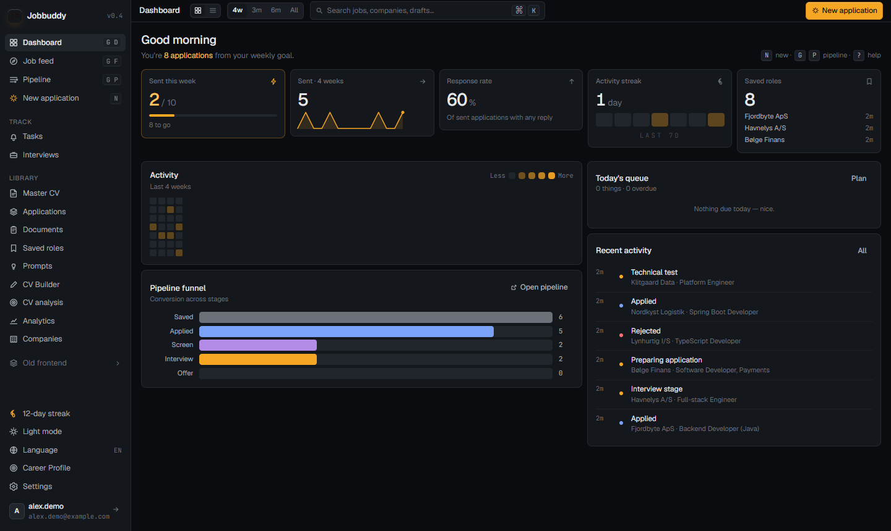
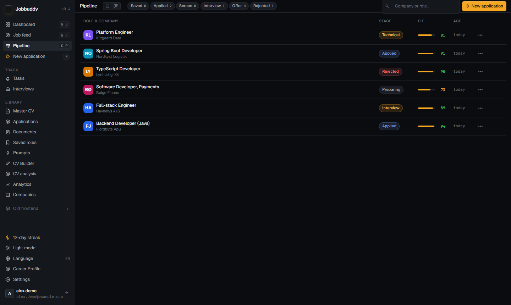
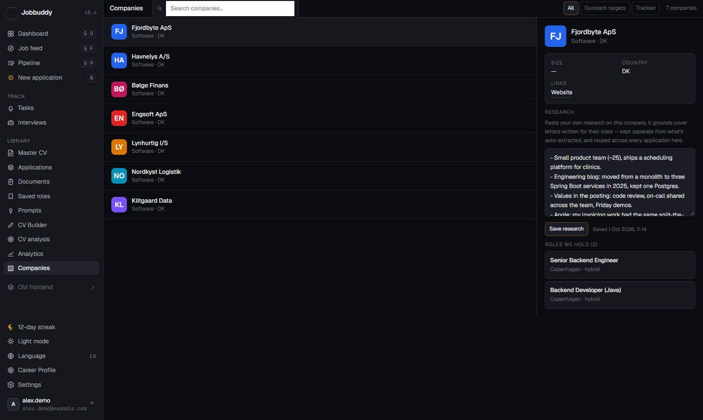

# Jobbuddy

I built Jobbuddy for my own job search, because tailoring a CV and cover letter to every single posting by hand gets old fast. It pulls in job postings, keeps a structured career profile, and uses AI to draft a tailored CV, cover letter and ATS (Applicant Tracking System) report for a specific posting, exported as PDFs.

It used to be called AutoApplicant. The Java package (`com.autoapplicant`) and the default database name still carry that name.



| Pipeline | Company research notes |
|---|---|
|  |  |

Screenshots are from a local run with a made-up account, companies and postings, signed in through the Firebase Auth emulator and with no AI key, so nothing AI-generated is shown.


## What it does

- Career profile with experience, education, skills and projects. You can bootstrap it by parsing an existing CV.
- Job discovery: a crawler over Jobindex, Jobnet, IT-Jobbank, Jobdanmark and a few ATS boards, plus Postgres full-text and pgvector semantic search.
- LinkedIn connector: personal-use and low-volume, over LinkedIn's public `jobs-guest` endpoints, driven by LLM-generated keyword plans per user. It runs on its own jittered schedule, separate from the shared crawl (see `docs/guides/db.md` and `app.linkedin.*` in `application.yml`).
- Document generation: CVs and cover letters tailored to one posting. An optional drafter/reviewer loop critiques and revises each draft before it's assembled.
- ATS reports on how well a generated document matches the posting.
- Guardrails against the model making stuff up: anti-fabrication rules (including not conflating tools of the trade), scraped job text treated as untrusted input, and a deterministic fact gate that flags metrics the profile doesn't support. The fact gate is plain code, no model call.
- Pluggable providers: OpenAI, Gemini, or a local CLI agent (Claude Code / Codex) so generation can run on a flat-fee subscription instead of per-call API billing. Embeddings always use a real API.
- All AI output is structured JSON, assembled server-side into a `StructuredDocument` (identity, sections, rendering options), then rendered to PDF with either an ATS-friendly or a designed template.
- Name, email, phone, photo and links are never sent to the AI provider. Identity is merged into the document after the AI call.
- Firebase JWT auth, optional LinkedIn integration, and an OpenAPI spec with Swagger UI.

## Stack

| Layer | Technology |
|---|---|
| Backend | Java, Spring Boot, Gradle (multi-module) |
| Architecture | Hexagonal (ports and adapters): `domain` / `port` / `usecase` / `adapter` |
| Frontend | Angular (standalone components, lazy-loaded routes) |
| Database | PostgreSQL with Flyway migrations |
| Search | Postgres full-text (`danish` config) + pgvector (`text-embedding-3-small`) |
| AI | OpenAI / Gemini API, or a local CLI agent (Claude Code / Codex) for generation |
| Auth | Firebase Authentication (JWT), optional LinkedIn OAuth |
| Docs | Springdoc OpenAPI / Swagger UI |
| Infra | Docker Compose (Postgres, backend, frontend) |

## Architecture

The backend is hexagonal. Anything crossing a boundary goes through a port interface:

```
adapter/            Spring controllers, JPA adapters, AI client, crawler, PDF renderer
  web/controller/   REST endpoints, depend on port/in interfaces only
  persistence/      JPA entities + adapters implementing port/out
  ai/               OpenAI client implementing AiProviderPort
  crawler/          Job posting crawler
  pdf/              PDF rendering
port/
  in/               Use case interfaces (what the application can do)
  out/              Repository/external service interfaces (what the app needs)
usecase/            Business logic, implements port/in, depends only on port/out
domain/             Plain records/value objects, no framework dependencies
```

The frontend follows the same idea: `core/api` (HTTP services), `core/models` (interfaces mirroring the backend records), `features` (routed components), `shared/components` (presentational).

## Running it

Full stack in Docker:

```bash
cp .env.example .env   # then fill in secrets
docker compose --env-file .env -f infra/docker-compose.yml up --build
```

Or locally, with only Postgres in Docker:

```bash
docker compose --env-file .env -f infra/docker-compose.yml up postgres -d

./gradlew :backend:bootRun                       # backend
cd frontend && npm install && npm run start:local  # frontend
```

| Service | URL |
|---|---|
| Frontend | http://localhost:4200 |
| Backend API | http://localhost:8080/api/v1 |
| Swagger UI | http://localhost:8080/swagger-ui.html |

### Configuration

You need:

- `OPENAI_API_KEY`, with access to `gpt-4o` and `text-embedding-3-small`
- a Firebase service account JSON at `.secrets/firebase-service-account.json`

Optional: `DB_*`, `LINKEDIN_CLIENT_ID`/`SECRET`, `ALLOWED_ORIGINS` (all have local defaults).

AI provider and feature toggles (optional, with defaults):

- `GENERATION_AI_PROVIDER`: `openai` (default), `gemini`, or `claude-cli` / `codex` / `cli` for a local agent. `ENRICHMENT_AI_PROVIDER` has to stay a real API because it produces embeddings.
- `AI_CLI_COMMAND`: the CLI used for generation with a local agent (default `claude -p`, prompt piped to stdin).
- `AUTO_REVIEW_ENABLED`: the reviewer critique/revise pass after generation (default `true`; each pass is one extra LLM call).
- `FACT_GUARD_ENABLED` / `FACT_GUARD_MODE`: the fact gate on generated metrics (`warn` by default, or `block`).
- `LINKEDIN_SCRAPER_ENABLED`, `LINKEDIN_LOCATIONS`: the LinkedIn connector (see `app.linkedin.*` in `application.yml`).

## Tests

```bash
./gradlew :backend:test          # backend
cd frontend && npm test          # frontend
cd frontend && npm run lint      # lint
```

## Docs

The rest lives in [`docs/`](docs/) (start at the [index](docs/README.md)): `specs/`, `architecture/`, `guides/` (setup, commands, testing, db), `product/` (strategy, features, notes on the Danish job market) and `archive/` for old material. Agent guidance is in [`CLAUDE.md`](CLAUDE.md).
